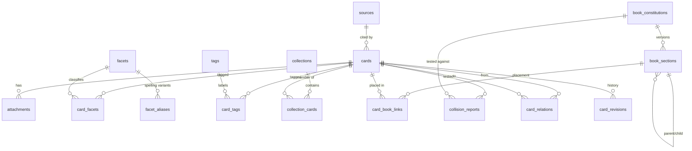

# Data model

Rangkhaneh uses PostgreSQL (via Supabase) with explicit SQL migrations in
`supabase/migrations/`. Every user-owned table has a `uuid` primary key, an
`owner_id` referencing `auth.users`, `created_at`/`updated_at` timestamps
(maintained by a trigger), and Row Level Security scoped to the owner.

- `0001_init.sql` — extensions, enums, normalization function, tables, indexes,
  and search triggers.
- `0002_rls.sql` — `enable row level security` + owner policies on every table.
- `0003_storage.sql` — the private `attachments` bucket and its storage policies.

## Enumerated vs. controlled-text values

Values that are structurally fixed use Postgres **enums** (`card_domain`,
`workflow_status`, `epistemic_status`, `book_relation`, `date_precision`,
`calendar_system`, `book_node_type`, `extraction_status`). Values that should be
able to grow **without a migration** (card types, source types, facet types,
rights statuses, relation types, use statuses, verdicts, attachment kinds) are
stored as `text` and validated in the app via `src/lib/constants/vocab.ts` +
Zod. This keeps the controlled vocabulary editable without a dangerous schema
change, as the brief requires.

## Entity–relationship overview

## Tables

### `cards` — the fundamental object

Identity/workflow (`title`, `domain`, `card_type`, `workflow_status`,
`epistemic_status`, `book_relation`, `is_favorite`), content kept in **separate**
columns so provenance is never ambiguous (`original_content` — preserved as-is —
plus `working_content`, `exact_quote`, `paraphrase`, `translation`,
`transliteration`, `summary`, `annotation`, `questions`, `why_it_matters`),
language (`language_codes[]`, `original_language`, `translation_language`),
provenance (`source_id`, `source_locator`, `provenance_note`, `rights_status`,
`reliability_note`), historical dating kept apart from capture timestamps
(`historical_date_label`, `historical_start_year`, `historical_end_year`,
`date_precision`, `calendar_system`), optional `color_swatches` (jsonb, labelled
visual references — not facts), timestamps (`captured_at`, `last_reviewed_at`,
`next_review_at`, `created_at`, `updated_at`, `deleted_at` for soft delete), and
trigger-maintained search columns (`search_related`, `search_all`,
`search_tsv`). Never displayed; see [`search.md`](search.md).

### `sources` — provenance records

`title`, `source_type`, `author_creator`, `publication`, `publisher`, `url`,
`archive`, `identifier` (ISBN/DOI/accession/shelf mark), `publication_date_label`,
`access_date`, `notes`.

### `facets` + `facet_aliases` — controlled vocabulary

`facets`: `facet_type`, bilingual `label_en`/`label_fa` (at least one required),
`description`. `facet_aliases`: `alias` strings (unique per facet) powering
spelling/transliteration matching (e.g. `qermez`, `ghermez`, `قرمز`).
`card_facets` links cards ↔ facets with an optional `note`.

### `tags` + `card_tags` — free-form vocabulary

`tags.label` with a `normalized` form (unique per owner). `card_tags` is the
many-to-many link.

### `attachments` — files (originals preserved)

`card_id`, `kind`, `storage_path` (private bucket), `original_filename`,
`mime_type`, `byte_size`, `checksum`, `caption`, `extracted_text` (stored
**separately** from the original file), `extraction_status`, `metadata` jsonb.

### `collections` + `collection_cards`

Curated sets. `collection_cards` carries a `position` (manual ordering) and a
per-item `note`.

### `book_constitutions` — versioned project state

`version_name`, `is_current` (a partial unique index enforces at most one
current per owner), structured sections (`project_description`,
`central_questions`, `provisional_thesis`, `counter_theses`, `accepted_claims`,
`rejected_claims`, `methodology`, `ethics`, `tone`, `chapter_outline`,
`glossary`, `known_problems`), a free `body_markdown`, and a `revision_note`.
Old versions are preserved.

### `book_sections` — hierarchical outline (Book Map)

Self-referential `parent_id`, `node_type` (project/part/chapter/section),
`title`, `summary`, `position`, optional `constitution_id`.

### `card_book_links` — card ↔ section placements

Unique on `(card_id, section_id)`. Carries `book_relation`, `intended_use`,
`priority`, `rationale`, `citation_note`, `excerpt_used`, `use_status`. Linking
never changes the card's archive status.

### `collision_reports` — the Collision Test

`card_id`, `constitution_id` (which version was tested), `authorship`
(human/ai), every structured prompt field (what it says, extracted units,
evidence vs. interpretation, missing verification, agreements, contradictions,
complications, forcing risk, possible uses, placement suggestions, independent
uses, verification tasks, related-card queries, warnings), `confidence`,
`verdict`, `human_rationale`, `status` (draft/complete), plus Phase-2
`ai_suggestion`/`ai_status` columns that are never used to overwrite human text.

### `card_relations` — typed directional links

`from_card_id`, `to_card_id`, `relation_type`, `note`.

### `card_revisions` — version history

Stores a `snapshot` (jsonb) of meaningful card content changes for a readable
history UI and a restore action.

### `user_settings`

`owner_id` PK, `ai_enabled` (default **false**), `preferences` jsonb,
`last_export_at`, `last_export_summary`.

## Design notes

- **Typed columns power filters; JSONB is used only where relational querying is
  unlikely to matter** (snapshots, ai suggestion payloads, metadata, swatches).
- **Soft delete** via `cards.deleted_at`; the Trash view restores by clearing it.
- **FK-safe ordering** for export/import lives in `src/lib/export/schema.ts`
  (`KEYED_TABLES`); see [`export-format.md`](export-format.md).
